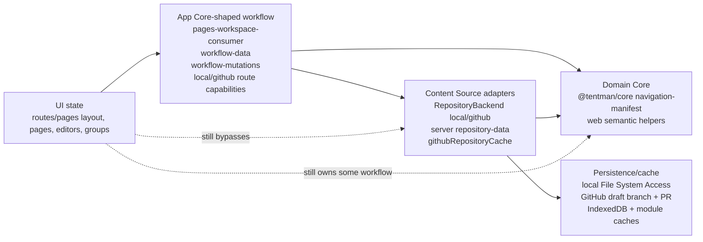
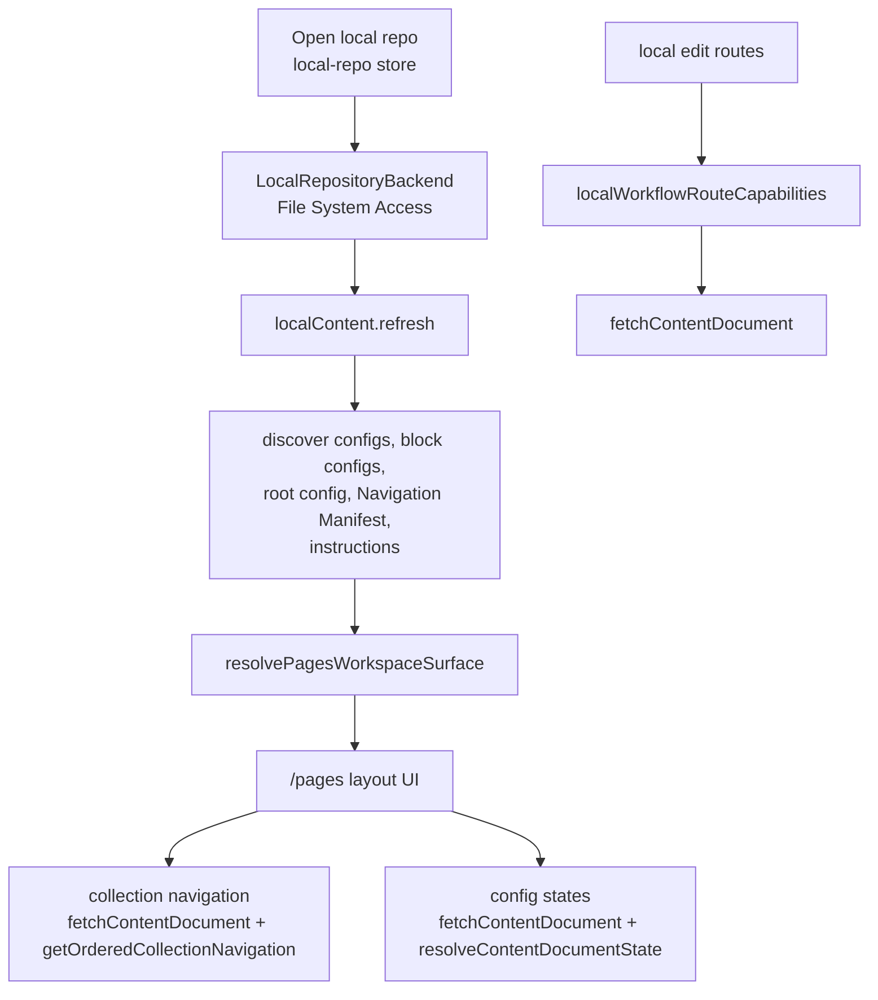
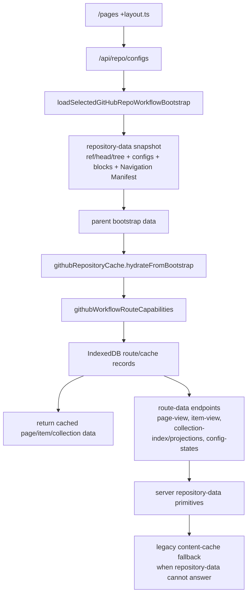
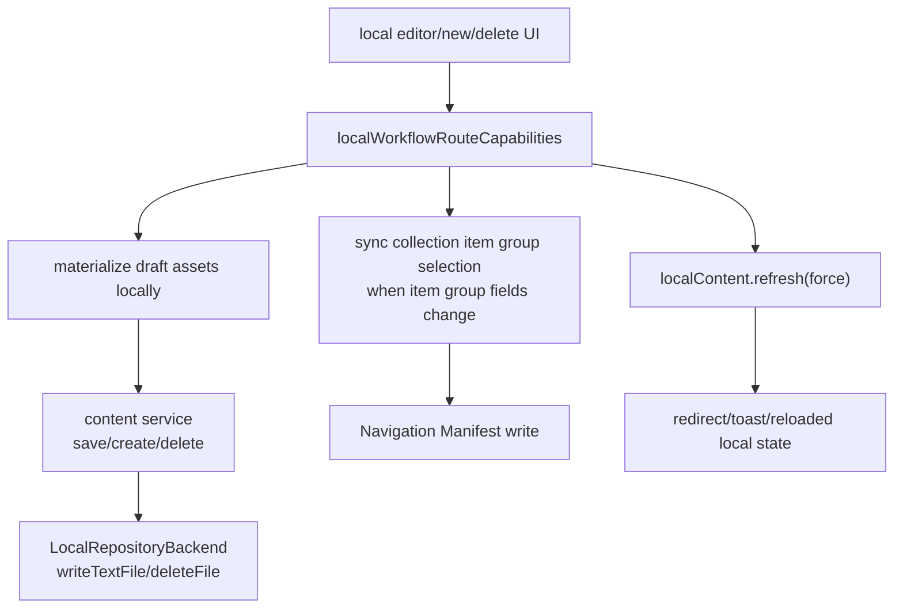
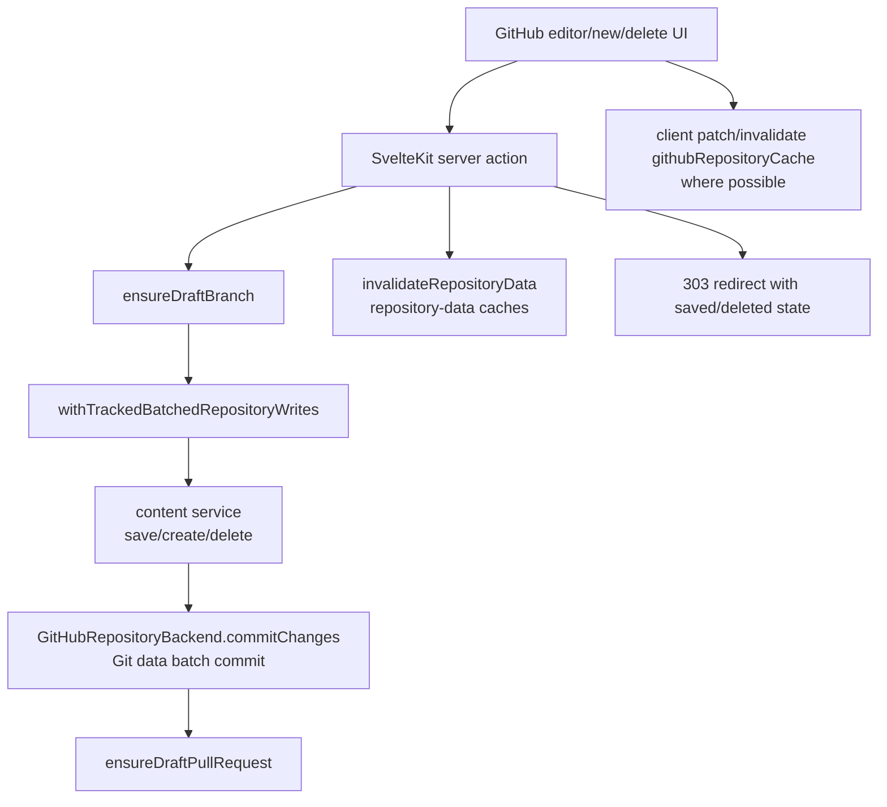
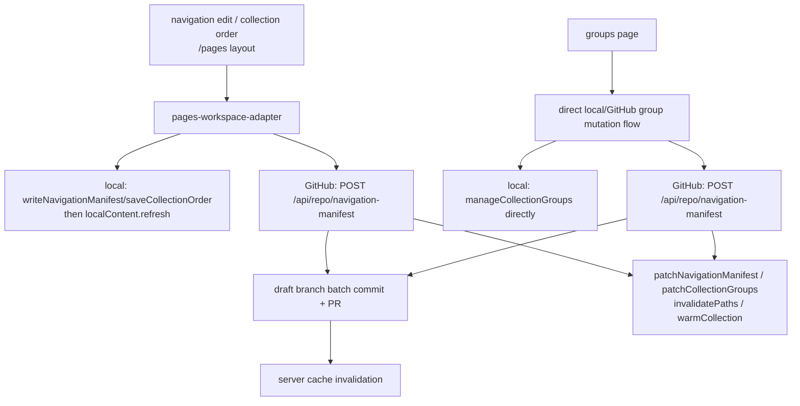

# Current Content-Management Data Flow

## Scope

This resolves [Trace current content-management data flow](../issues/01-trace-current-content-management-data-flow.md) by tracing current reads, writes, persistence, commits/sync, Navigation Manifest state, collection groups, and cache/freshness across local folder mode and GitHub-backed mode.

This is planning and diagnosis only. No product code was changed.

## High-Level Shape

Tentman already has the vocabulary of a source-independent workflow layer, but the current implementation is still split across route modules, Svelte components, browser stores, server endpoints, and repository helpers.

Current module roles:

- UI state: `apps/web/src/routes/pages/+layout.svelte`, page/edit/new/group Svelte components, sidebar and collection panel components.
- App Core-shaped layer: `pages-workspace-consumer.ts`, `pages-workspace-adapters.ts`, `workflow-data.ts`, `workflow-mutations.ts`, `local-workflow-route-capabilities.ts`, and `github-workflow-route-capabilities.ts`.
- Domain Core: `packages/core/src/navigation-manifest.js` via `@tentman/core/navigation-manifest`; the web wrapper in `apps/web/src/lib/features/content-management/navigation-manifest.ts` uses core parsing/normalization but still owns many semantics for setup, writing, repair, group sync, and collection order.
- Content Source adapters: `RepositoryBackend`, `repository/local.ts`, `repository/github.ts`, server `repository-data/*`, and browser `github-repository-cache.ts`.
- Route/API layer: `/pages` loads, `/api/repo/*` endpoints, and `page-context.ts`.
- Cache layer: `local-content.ts` plus localStorage/discovery signatures; browser `github-repository-cache.ts` plus IndexedDB; server `repository-data` module caches; older `content-cache.ts` and `config-cache.ts`.
- Commit/sync layer: local mode writes directly to selected files with no Git commit; GitHub mode writes to a managed draft branch and ensures a draft PR.

## Read Flow

### Local Folder Mode

Local mode starts in the browser. `localRepo` persists a selected `FileSystemDirectoryHandle` in IndexedDB, recreates a `LocalRepositoryBackend`, and persists the backend selection to the session endpoint. `localContent.refresh` then reads the repository through that backend: root config, content configs, block configs, Navigation Manifest, instruction discovery, and a discovery signature. It can reuse a localStorage cache when the discovery signature matches.

The `/pages` layout receives no meaningful server bootstrap for local mode. Instead, it resolves a local workspace surface from `localContent`, then loads local collection navigation and config states in the browser. Singleton and item edit routes also return local placeholders from route loads; their Svelte components call `localWorkflowRouteCapabilities`, which refreshes `localContent` and reads content documents directly.

Collection groups are another local browser path: the groups route returns a placeholder, and the Svelte component loads local navigation by reading content and ordering it against the current Navigation Manifest.

### GitHub-Backed Mode

GitHub mode has both server and browser read paths:

- `/pages/+layout.ts` calls `/api/repo/configs`.
- `/api/repo/configs` calls `loadSelectedGitHubRepoWorkflowBootstrap`, which loads a selected repository context, discovers the managed draft branch if present, builds a repository snapshot for the active ref, optionally builds a main snapshot, loads Navigation Manifest state, and returns workflow bootstrap data.
- The browser layout hydrates `githubRepositoryCache` from that bootstrap and starts the freshness scheduler.
- GitHub page and item route loads first try `githubWorkflowRouteCapabilities`, which delegates to `githubRepositoryCache`.
- On cache misses, route capabilities and cache tasks fetch route endpoints such as `/api/repo/page-view`, `/api/repo/item-view`, `/api/repo/collection-index`, `/api/repo/collection-projections`, and `/api/repo/config-states`.
- Server `repository-data/route-data.ts` prefers prepared repository-data primitives and then falls back to `content-cache` when repository-data cannot answer.

The repository-data read primitives are relatively deep already: snapshots own ref/head/tree identity, config discovery, block discovery, and Navigation Manifest state; collection indexes/projections resolve directory-backed and file-backed collections; singleton documents and item documents can be resolved by tree/blob identity.

## Write Flow

### Local Content Writes

Local singleton edits, collection item edits, item creates, and deletes happen directly in the browser through `localWorkflowRouteCapabilities`. The workflow capabilities materialize local draft assets, call content service adapters, write via `LocalRepositoryBackend`, optionally sync collection item group selection into the Navigation Manifest, return a `WorkflowMutationResult`, and force-refresh `localContent`.

There is no local commit or sync concept in the current path. A successful local mutation means the selected filesystem files were written immediately.

### GitHub Content Writes

GitHub content saves, item creates, and deletes run through SvelteKit server actions in the edit/new route modules. Each action ensures a managed draft branch, batches writes with `withTrackedBatchedRepositoryWrites`, uses the shared content service to produce repository file changes, commits those changes to the draft branch through the Git Data API, ensures a draft PR, invalidates server repository-data caches, creates a workflow mutation result, and redirects.

The browser enhancement path separately patches or invalidates `githubRepositoryCache` when it can infer changed paths or submitted content. Because redirects hide the server-side mutation object from normal client consumption, the client sometimes recreates a mutation result to drive cache cleanup and recovery cleanup.

### Navigation Manifest, Collection Order, and Collection Groups

Top-level Navigation Manifest edits and collection ordering go through the pages workspace adapter. In local mode, it writes through web Navigation Manifest helpers and refreshes all local collection navigation/config states. In GitHub mode, it posts to `/api/repo/navigation-manifest`, which handles enable/repair/add ids/save manifest/manage groups/save order in one endpoint, writes to a draft branch, invalidates server caches, and returns changed paths and Navigation Manifest state.

Collection group management is less centralized. The dedicated groups page calls `manageCollectionGroups` directly in local mode and posts `manage-collection-groups` to the same GitHub endpoint in GitHub mode. New/edit item forms can also create missing group options while editing select fields; those flows call local `manageCollectionGroups` or the same GitHub endpoint.

## Cache and Freshness

Local freshness is discovery-signature based. `localContent.refresh` compares root config text, Navigation Manifest text, content config paths/text, block config paths/text, and component files. When the signature matches, it keeps current or persisted local state; when it differs or `force` is used, it invalidates discovery/component caches and rereads. After local writes, current mutation flows force-refresh `localContent`.

GitHub freshness is identity/path based. The browser cache writes an active snapshot into IndexedDB from bootstrap data, builds an inventory of snapshot, block support, singleton document, collection index, projection, and item document records, and starts a scheduler. `checkFreshness` calls `/api/repo/freshness` with previous ref/head/tree identity. The server compares active identity and, when changed, loads trees to derive changed paths. The browser then marks affected inventory records stale, error, or checked. After GitHub mutations, server actions call `invalidateRepositoryData`, while client code patches/invalidate browser cache records with `patchNavigationManifest`, `patchCollectionGroups`, `patchCollectionItemFromContent`, `invalidatePaths`, or `warmCollection`.

The current system therefore has four cache layers that can affect read-after-write behavior:

- local browser state and localStorage cache in `localContent`;
- GitHub browser IndexedDB/cache inventory in `githubRepositoryCache`;
- server repository-data module caches for snapshots, collection indexes/navigation, singleton documents/states, and draft change indexes;
- older server `config-cache` and `content-cache` fallback caches.

## Parallel Routes and Unclear Ownership

- App Core is present but not decisive. `pages-workspace-consumer` defines mode-neutral intents/results, and `workflow-data`/`workflow-mutations` define shared payload vocabulary, but routes and components still make many source-specific decisions directly.
- `pages-workspace-adapters` is a mixed seam: it accepts mode-neutral intents, but its implementation knows local stores, GitHub browser cache, endpoint paths, invalidation, draft branch store updates, and local persistence.
- GitHub read routing is split between parent bootstrap, browser `githubRepositoryCache`, route capabilities, server route endpoints, repository-data helpers, and legacy `content-cache` fallback.
- Collection navigation has several routes to the same output: local `fetchContentDocument + getOrderedCollectionNavigation`, browser GitHub cache index/projection ordering, server repository-data collection navigation, and legacy `/api/repo/collection-items`/`content-cache` fallback.
- Collection group mutation paths are not fully under the pages workspace adapter: the groups page and form select-option creation flows call Navigation Manifest mutation helpers/endpoints directly.
- `WorkflowMutationResult` is useful vocabulary but not yet an authoritative contract. It is created in local workflow capabilities, GitHub server actions/endpoints, pages workspace adapter responses, and client enhancement cleanup code.
- Navigation Manifest semantics mostly go through the web wrapper backed by `@tentman/core/navigation-manifest`, but the web wrapper still owns enough parsing, repair, stable-id, group sync, collection order, and write behavior that the Domain Core boundary needs the dedicated audit ticket.
- Cache freshness after mutation is behaviorally split: local writes force a local rescan; GitHub writes invalidate server repository-data and then rely on client patch/invalidate/warm behavior plus later freshness checks. The exact user guarantee after save/reload is not yet a single source-independent contract.

## Decision

The current system works as a mode-neutral workflow only in patches. The intended shared data-flow map should treat the existing workflow vocabulary as a promising App Core seed, not as the current architecture boundary.

For follow-up tickets:

- [Define the intended editing mental model](../issues/02-define-intended-editing-mental-model.md) should decide the read-after-write and reload guarantees before cache contracts are locked.
- [Audit the Navigation Manifest Domain Core boundary](../issues/03-audit-navigation-manifest-domain-core-boundary.md) should focus on whether web Navigation Manifest helpers are legitimate App Core/Content Source orchestration or duplicated Domain Core semantics.
- [Explain collection group lifecycle and divergence](../issues/04-explain-collection-group-lifecycle-and-divergence.md) should treat group management as an ownership problem, because group mutations are currently spread across layout adapter, groups page, item edit, new item, Navigation Manifest helpers, GitHub endpoint, and browser cache patching.
- [Decide the App Core and Content Source boundary](../issues/06-decide-app-core-and-content-source-boundary.md) should decide whether workflow mutation results become an authoritative App Core contract or remain descriptive objects emitted by source-specific flows.

No new frontier ticket is needed from this trace. The current blocked tickets already cover the specific deeper investigations surfaced here.
